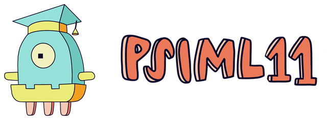
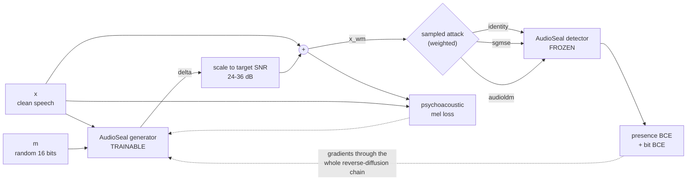

<p align="center">
  
</p>

<h1 align="center">Audio watermarking vs. diffusion attacks</h1>

<p align="center">
  <em>Can a speech watermark survive being regenerated by a diffusion model?</em><br />
  Built at <a href="https://psiml.pfe.rs/">PSIML 11</a> — Practical Seminar in Machine Learning, a machine learning summer school in Serbia.
</p>

<p align="center">
  <a href="https://huggingface.co/collections/msaidov/audioseal-robustness-to-diffusion-attacks"></a>
  
  
</p>

---

## What this is

[AudioSeal](https://github.com/facebookresearch/audioseal) embeds an inaudible,
localized watermark into speech, and a detector recovers it — plus a 16-bit
payload — even after ordinary audio edits. But a motivated adversary does not
*edit* audio; they **regenerate** it. Run a watermarked clip through a diffusion
model and the model resynthesises the signal from its own prior, discarding
whatever perturbation carried the watermark.

This repo measures that threat and does something about it. It:

1. Wires up real diffusion models as **differentiable attacks** inside the
   training loop, so gradients flow back through the entire reverse-diffusion
   chain into the watermark generator;
2. **Fine-tunes only the AudioSeal generator** against them, leaving the
   detector frozen and untouched — so the result stays a drop-in replacement;
3. Evaluates with one attack **held out**, to test whether robustness learned
   against one diffusion model transfers to a structurally different one.

> **The short answer to the research question:** it largely does *not* transfer.
> A generator hardened against SGMSE measured substantially worse on held-out
> AudioLDM than on SGMSE itself, which is why the mixed-attack recipes exist.

## Released models

Two fine-tuned generators are on the Hub, grouped in
**[this collection](https://huggingface.co/collections/msaidov/audioseal-robustness-to-diffusion-attacks)**:

| Model | Trained against | Held out | Data |
|---|---|---|---|
| [`msaidov/audioseal-robust-sgmse-16bits`](https://huggingface.co/msaidov/audioseal-robust-sgmse-16bits) | SGMSE (OU-VE SDE speech enhancement), 50/50 with identity | AudioLDM, MBD | 10 h of `train-clean-100` |
| [`msaidov/audioseal-robust-audioldm-16bits`](https://huggingface.co/msaidov/audioseal-robust-audioldm-16bits) | AudioLDM (latent-diffusion resynthesis), 50/50 with identity | SGMSE, MBD | full `train-clean-100` |

Both are 16 kHz, 16-bit payload, and work with the **stock**
`audioseal_detector_16bits` detector. The published `generator.pth` files are
portable AudioSeal checkpoints, so consumers only need the upstream `audioseal`
package; the raw training checkpoints are preserved separately as
`generator_train_ckpt.pth`.

## Quickstart: watermark audio with a robust generator

```bash
pip install audioseal huggingface_hub torch torchaudio
```

```python
import torch, torchaudio
from audioseal import AudioSeal
from huggingface_hub import hf_hub_download

REPO = "msaidov/audioseal-robust-sgmse-16bits"   # or ...-audioldm-16bits

# 1. Load the published portable generator checkpoint.
generator = AudioSeal.load_generator(hf_hub_download(REPO, "generator.pth"))

# 2. Watermark a 16 kHz mono clip.
wav, sr = torchaudio.load("speech.wav")          # (channels, samples)
assert sr == 16000
wav = wav.unsqueeze(0)                           # (batch, channels, samples)

msg = torch.randint(0, 2, (wav.shape[0], 16))
delta = generator.get_watermark(wav, sr, message=msg)

# Scale to a target SNR, the way training did (see embed_watermark in train.py)
# instead of adding the raw amplitude. Per-example over the time axis.
target_snr_db = 30.0
scale = (wav.norm(dim=-1, keepdim=True) / delta.norm(dim=-1, keepdim=True).clamp_min(1e-8)) \
        * (10 ** (-target_snr_db / 20))
watermarked = wav + scale * delta

# 3. Detect with the UNMODIFIED AudioSeal detector.
detector = AudioSeal.load_detector("audioseal_detector_16bits")
prob, decoded = detector.detect_watermark(watermarked, sr)
print(f"watermark probability: {prob.item():.3f}")
print(f"bit accuracy: {(decoded.cpu() == msg).float().mean().item():.3f}")
```

## How the training loop works

Every step samples **one** attack branch, applies it to the watermarked audio,
and scores the result with the frozen detector. The attack is differentiable, so
the generator learns to place the watermark where the diffusion model will
preserve it.



Loss:

```
L = lambda_det * (BCE(presence) + lambda_bit * BCE(bits)) + lambda_perc * mel_loss
```

The mel loss weights each mel bin by a Terhardt absolute-threshold-of-hearing
curve, so perturbation energy hidden in less audible bands is penalised less.

## The attacks

Defined in [`src/audioseal_robust/attacks.py`](src/audioseal_robust/attacks.py).
All are frozen but differentiable, so any of them can be trained against.

| name | what it does | status |
|---|---|---|
| `identity` | no-op passthrough | always available |
| `sgmse` | [SGMSE](https://github.com/sp-uhh/sgmse) OU-VE SDE speech enhancement; partial corruption to `t*`, then predictor-corrector reverse sampling | vendored in `src/sgmse/`, needs a checkpoint |
| `audioldm` | [AudioLDM](https://github.com/haoheliu/AudioLDM-training-finetuning) latent diffusion; mel → VAE latent → diffuse to `t*` → reverse UNet → HiFi-GAN re-vocode | vendored in `src/audioldm_train/`, needs checkpoints |
| `mbd` | Meta MultiBand Diffusion, EnCodec-conditioned diffusion decoder | eval-only, weights auto-download |
| `hopskipjump` | AudioMarkBench hard-label **black-box evasion** against the detector itself — not a resynthesis attack | eval-only, expensive |
| `bigvgan`, `dac` | vocoder / neural-codec resynthesis | stubs, raise with setup instructions |

Both diffusion attacks share a `t*` "strength" convention: `0` = untouched,
`1` = full noise-and-regenerate. This is the x-axis of the robustness curves
that `evaluate.py` plots.

## Setup

Python **3.10** (see `.python-version`; the SEANet variant AudioSeal builds
differs below 3.10, which changes checkpoint key naming).

```bash
pip install -r requirements.txt              # core audioseal inference
pip install -r requirements-training.txt     # training + eval, identity/sgmse attacks
pip install -r requirements-audioldm.txt     # only if you want the audioldm attack
# MBD needs a two-step install -- see the header of requirements-mbd.txt
```

There is no package install step: every entry point runs with `PYTHONPATH=src`.

Model weights are never in git. Supply them on the CLI:

| attack | what to supply |
|---|---|
| `sgmse` | `attack.sgmse.checkpoint=/path/to/sgmse_vb_pretrained.ckpt` |
| `audioldm` | `attack.audioldm.checkpoint=/path/to/audioldm-s-full` **and** `attack.audioldm.config=src/audioldm_train/config/2023_08_23_reproduce_audioldm/audioldm_original.yaml` |

## Training

Config is OmegaConf: a structured schema
([`config.py`](src/audioseal_robust/config.py)) merged with
[`config/default.yaml`](src/audioseal_robust/config/default.yaml), then a named
**recipe**, then CLI overrides — so a CLI flag always wins.

```bash
# Smoke test first: a few steps on a few minutes of audio.
./run_train_smoke.sh

# Real run: trains against SGMSE half the time, identity the other half.
PYTHONPATH=src python -m audioseal_robust.train \
    recipe=sgmse_mixed \
    attack.sgmse.checkpoint=/path/to/sgmse_vb_pretrained.ckpt \
    data.train_dir=/path/to/LibriSpeech/train-clean-100 \
    data.valid_dir=/path/to/LibriSpeech/dev-clean \
    data.batch_size=8 eval_every=100 lambda_bit=2.0
```

Recipes ([`config/recipes.yaml`](src/audioseal_robust/config/recipes.yaml)):

| recipe | attack weights | why |
|---|---|---|
| `sgmse` / `audioldm` | attack 1.0 | pure single-attack training |
| `sgmse_mixed` / `audioldm_mixed` | 0.5 identity + 0.5 attack | gives the generator unattacked steps to anchor bit accuracy on, and halves exposure to the attacks' gradient spikes |
| `sgmse_audioldm_mixed` | 0.5 / 0.25 / 0.25 | trains against **both**, since robustness did not transfer between them zero-shot |

Checkpoints land in a timestamped subfolder as `generator_epochN.pth`, each
storing `{"model": state_dict, "xp.cfg": config}`. Raw training checkpoints are
not publishable as-is; see [`docs/PUBLISHING.md`](docs/PUBLISHING.md) for the
export step that produces portable AudioSeal checkpoints.

**Multi-GPU** is DDP via `torchrun`, and single-GPU behaviour is unchanged
(every distributed helper is a no-op at `world_size=1`):

```bash
torchrun --standalone --nproc_per_node=4 -m audioseal_robust.train ...
```

Read [`docs/MULTI_GPU.md`](docs/MULTI_GPU.md) before comparing any multi-GPU
number against a single-GPU baseline — `batch_size` is per rank, but
`n_eval_batches` is global, deliberately.

For Azure ML submission (environment, data assets, job specs), see
[`azureml/README.md`](azureml/README.md).

## Evaluation

```bash
# Baseline: stock AudioSeal, no fine-tuning.
PYTHONPATH=src python -m audioseal_robust.evaluate \
    eval_dir=/path/to/LibriSpeech/test-clean label=baseline

# A fine-tuned checkpoint, with the matching eval recipe.
PYTHONPATH=src python -m audioseal_robust.evaluate \
    recipe=after_sgmse_training \
    generator_checkpoint=./checkpoints/.../generator_epoch3.pth \
    eval_dir=/path/to/LibriSpeech/test-clean label=finetuned_sgmse \
    attack.sgmse.checkpoint=/path/to/sgmse_vb_pretrained.ckpt
```

Reported per attack branch: **bit accuracy**, **TPR@FPR**, **ROC-AUC**,
confusion counts, **SI-SNR** and **PESQ**, plus a `t*` robustness curve and
confusion-matrix plots under `./eval_outputs`.

Two traps the harness guards against, both of which quietly manufacture fake
robustness if ignored:

- **FPR resolution.** An empirical FPR of *f* needs at least *1/f* negatives to
  resolve at all. `evaluate.py` reports `fpr_support` and warns rather than
  silently relaxing the target.
- **Attack failure ≠ robustness.** If an attack fails to run or to initialize,
  that is reported as `attack_failure_rate`, not counted as the watermark
  surviving.

For the AudioLDM attack specifically, evaluate on a fixed-duration **10.24 s**
set with `segment_duration=10.24` — its native window. Otherwise the attack pads
every shorter clip and the numbers are not comparable
(see [`build_fixed_duration_eval_set.py`](build_fixed_duration_eval_set.py)).

## Repo layout

```
src/audioseal_robust/   this project: training, attacks, eval, metrics, plotting
src/audioseal/          AudioSeal generator/detector (from facebookresearch/audioseal)
src/sgmse/              vendored SGMSE score model            (see VENDORED.md)
src/audioldm_train/     vendored AudioLDM latent diffusion    (see VENDORED.md)
azureml/                Azure ML environment, data assets, job specs
docs/                   MULTI_GPU.md; PUBLISHING.md; TRAINING.md (upstream AudioSeal/Dora)
tests/                  pytest suite, incl. real multi-process torchrun workers
run_*.sh                ready-made launchers (smoke, 10h, 100h, 4-GPU, eval sweeps)
```

Entry points: `train`, `evaluate`, `sanity_check` (throughput/wiring check),
`dump_audio` (write attacked examples to disk), `report`.

```bash
pytest                 # full suite
pytest -m "not slow"   # skip the multi-process DDP tests
```

## Vendored code and licenses

This project's own code is MIT. It vendors, unmodified except where each
`VENDORED.md` records otherwise:

- [`src/audioseal`](src/audioseal) — AudioSeal, © Meta Platforms (MIT)
- [`src/sgmse`](src/sgmse) — SGMSE, © Signal Processing, Universität Hamburg (MIT)
- [`src/audioldm_train`](src/audioldm_train) — AudioLDM training/finetuning code (MIT)

No third-party model weights are redistributed here or in the released
checkpoints; SGMSE and AudioLDM are used strictly as training-time attacks.

## Acknowledgements

Built as a student project at **[PSIML 11](https://psiml.pfe.rs/)** — Practical
Seminar in Machine Learning, a machine learning summer school in Serbia. Thanks
to the organisers and mentors for the compute and for the guidance on the
experiment design.

## References

This project is not itself a paper — it builds on three. If you use it, cite the
work it depends on. All entries below are taken from each project's own README.

**AudioSeal** — the watermarking model these checkpoints fine-tune:

```bibtex
@article{sanroman2024proactive,
  title   = {Proactive Detection of Voice Cloning with Localized Watermarking},
  author  = {San Roman, Robin and Fernandez, Pierre and Elsahar, Hady and
             D{\'e}fossez, Alexandre and Furon, Teddy and Tran, Tuan},
  journal = {ICML},
  year    = {2024}
}
```

**SGMSE** — the score-based speech enhancement model used as an attack:

```bibtex
@article{richter2023speech,
  title   = {Speech Enhancement and Dereverberation with Diffusion-based
             Generative Models},
  author  = {Richter, Julius and Welker, Simon and Lemercier, Jean-Marie and
             Lay, Bunlong and Gerkmann, Timo},
  journal = {IEEE/ACM Transactions on Audio, Speech, and Language Processing},
  volume  = {31},
  pages   = {2351--2364},
  year    = {2023},
  doi     = {10.1109/TASLP.2023.3285241}
}
```

**AudioLDM** — the latent diffusion model used as an attack:

```bibtex
@article{liu2023audioldm,
  title   = {{AudioLDM}: Text-to-Audio Generation with Latent Diffusion Models},
  author  = {Liu, Haohe and Chen, Zehua and Yuan, Yi and Mei, Xinhao and
             Liu, Xubo and Mandic, Danilo and Wang, Wenwu and Plumbley, Mark D.},
  journal = {Proceedings of the International Conference on Machine Learning},
  pages   = {21450--21474},
  year    = {2023}
}
```
